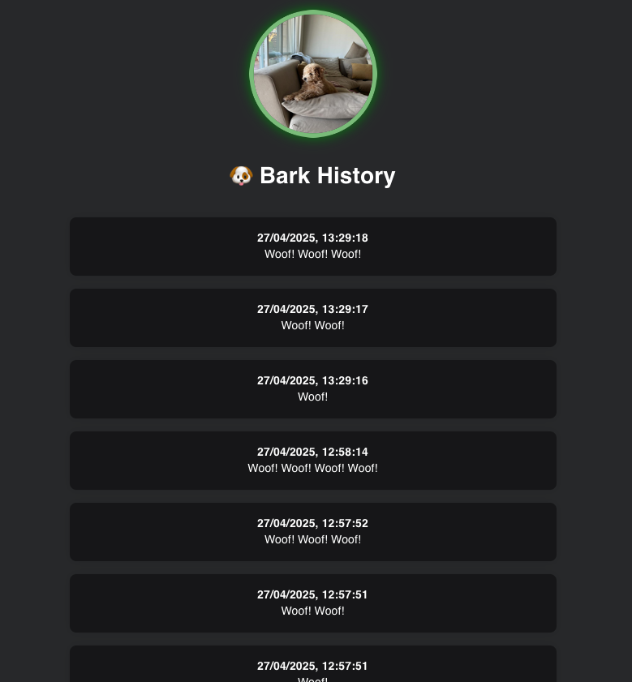

# Hey Sheldon


**Audio Detection and Bark Notification System**

     

<br>
Use Case

  
## Features

- Detects "barks" based on sound amplitude (MAX_RMS_AMPLITUDE)
- Sends a notification when 3 barks are detected within 60 seconds
- Node.js server for API and sound detection logic
- React.js client served via optimized Nginx
- Dockerized for easy deployment
- Supports local SQLite persistence
- Minimal configuration, fast startup

<br>


Hey Sheldon is a lightweight, audio-based event detection platform built for rapid deployment and ease of use.

It continuously listens for sound and sends a notification when it detects `3 bark-like` sounds within a `60-second` window.  

The system combines `Node.js` for backend audio processing with a `React.js` frontend served through `Nginx`, all containerized via `Docker` for hassle-free usage.

Hey Sheldon is perfectly suited for pet monitoring, environmental alerts, and custom audio event detection scenarios.

---

## Project Structure

```bash
Hey-Sheldon/
├── client/              # Frontend (React app, built with Node, served via Nginx)
│   ├── build/           # Production-ready static files
│   ├── src/             # Source code
│   └── nginx.conf       # Nginx configuration for serving the frontend
├── server/              # Backend (Node.js sound detection server)
│   ├── server.js        # Main server logic
│   ├── config.json      # Configuration file
│   └── Dockerfile       # Backend Dockerfile
├── docker-compose.yml   # Multi-container orchestration
└── README.md            # Project documentation
```

---

## Setup

### Prerequisites

- Docker
- Docker Compose
- Node.js 16 for client development (material.ui dependency)
- Node.js 20+ for server development
- A USB microphone
- A Raspberry Pi (optional, but recommended for deployment)
- sox, alasa-lib, alsa-utils (for sound detection)

### Startup

- On mac

```shell
  brew install sox
```

- On Linux

```shell
  apt-get install sox alsa-lib alsa-utils
```

---

## Quick Start

```bash
# Clone the repository
git clone https://github.com/your-org/hey-sheldon.git
cd hey-sheldon

# Build and run the full stack
docker-compose up --build

# Or run the deploy script
./deploy.sh
```

- Server endpoint at: `http://localhost:5100/api/messages`
- Frontend available at: `http://localhost:3000`
- Customize the `MAX_RMS_AMPLITUDE` in `server/config.json` if needed.


---

## How It Works

| Component    | Tech          | Description                                                |
|:-------------|:--------------|:-----------------------------------------------------------|
| **Frontend** | React + Nginx | Compiled into static files (`build/`) and served via Nginx |
| **Backend**  | Node.js       | Express-based API + sound detection logic                  |
| **Database** | SQLite        | Local persistent database (mounted via Docker volume)      |

---

## Build Process (Client)

The frontend (`client/`) uses a **multi-stage Docker build**:

1. **Node.js stage**: installs dependencies and builds the React app.
2. **Nginx stage**: copies the static build output into an Nginx image.

**Dockerfile excerpt:**

```Dockerfile
FROM node:16-alpine AS build
WORKDIR /app
COPY package.json package-lock.json ./
RUN npm install
COPY . .
RUN npm run build

FROM nginx:alpine
COPY --from=build /app/build /usr/share/nginx/html
COPY nginx.conf /etc/nginx/conf.d/default.conf
EXPOSE 80
CMD ["nginx", "-g", "daemon off;"]
```

---

## Environment Variables

The backend server uses the following environment variables:

| Variable | Description                         |
|:---------|:------------------------------------|
| `TZ`     | Timezone for logging and scheduling |

---

## Development Tools

- **Frontend**:  
  For local development:

  ```bash
  cd client
  rm -rf node_modules
  npm cache clean --force
  npm install --legacy-peer-deps
  npm start
  ```

  Then visit `http://localhost:3000`.
<br>
<br>
- **Backend**:  
  For backend development:

  ```bash
  cd server
  rm -rf node_modules
  npm cache clean --force
  npm install
  npm start # or node server.js
  ````

  Then visit `http://localhost:5100`.
---

## Troubleshooting

- If you see `403 Forbidden` errors from Nginx:
    - Make sure the `build/` folder is **properly generated** (`npm run build`) before running Docker Compose.
    - Ensure correct permissions (`chmod -R 755 build`).
    - Validate that `nginx.conf` is correctly mapped and does **NOT** contain forbidden directives like `user nginx;`
      inside `conf.d/*.conf`.


- Always **rebuild** containers after making changes:

  ```bash
  docker-compose down
  docker-compose up --build
  ```

---

## Future Improvements


## Future Improvements

- [ ] **Add SSL to Production Frontend**  
  Implement HTTPS on the production frontend using Let's Encrypt for secure access.

- [ ] **Enhanced Client-Side Error Handling**  
  Improve the React frontend to handle backend or network failures more gracefully.

- [ ] **Integrate AI-Based Bark Detection**  
  Move beyond basic amplitude checks by training machine learning models to recognize bark patterns.

- [ ] **Support Customizable Sound Event Patterns**  
  Allow users to define their own trigger sounds (e.g., claps, whistles) for flexible event detection.

- [ ] **Real-Time Updates via WebSocket**  
  Push live detection events to the frontend without requiring page refreshes.

- [ ] **Frontend-Controlled Sensitivity Adjustment**  
  Let users change sound sensitivity settings directly from the web app.

- [ ] **Live Sound Monitoring Graph**  
  Display a real-time audio waveform on the frontend for live sound activity monitoring.

- [ ] **Expanded Sound Analytics Dashboard**  
  Add detailed visualizations of detected events, sound waveforms, and detection trends.
---

## License

This project is licensed under the [MIT License](LICENSE).

---

# 🚀 Happy Bark Monitoring!